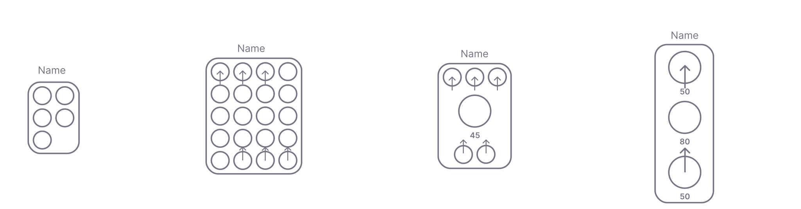

# Circuit

Circuit is the collection of nodes (neurons, organs, another circuits) and connections between them. Om the engine level, it is just a functional collection of neurons and synapses. Circuits can be grouped, nested, shared and saved as a prototype to be reused further. It is a powerful tool to create nested structures. The root circuit is the top level circuit, executed by engine. Special type of circuit is the root circuit, that is called Connectome.

## Display
Circuits are displayed as a set of neurons, arranged in a grid, hidden in the circuit boundary. Depending on the number of neurons, circuit thumbnails will be displayed differently:

Neurons, marked as input and output, are displayed on top and the bottom of the thumbnail accordingly.  
## Properties

| Name                             | Type                 | Default                        | Description                                                                                                                                |
| -------------------------------- | -------------------- | ------------------------------ | ------------------------------------------------------------------------------------------------------------------------------------------ |
| `title`                    | `String` | ""                    | Display name of the circuit                   |
| `description`              | `String`             | ""                            | Markdown string                           |
| `isReusable`              | `Boolean`             | `false`                            | If true, circuit will appear in the explorer and circuits list as a reusable component                           |
| `isShared`              | `Boolean`             | `false`                            | If true, circuit will be accessible by all users of Flux in the global explorer.                          |

## Creating circuits

You can create a circuit by selecting the neurons with selection tool, and providing the cicruit properties in the opened dialog:

Root circuits can be created by hitting Create new on the top.

## Nesting circuits

Circuits can be the nodes of another circuits, with any level of nesting. We highly recommend to keep clean on the input and output neurons, so the circuit is clean. The hierarchy is reflected in the left pane. You can extend and collapse circuits, and open it in another editor tab.

## Grouping circuits

Sometimes you need to have a bound copies of circuits, so that the changes on one circuit will propagate to all others. This can be done by selecting the circuit, and enter the grouping mode. Another option, when cloing the circuit, choose pair option.
## Inheriting circuits

Once you create a circuit, in the settings, you can make it reusable:

Now it will appear as an explorer, and you will be able to use it as a prototype. Just drag it to the editor plane, and choose whether you need it to be expanded, or added as a node.

## Root circuit

Root circuit shares the same features, except for adding another properties, like global env variables, that can be used inside organs.

## Circuit files

Circuit data is stored in the binary, with .flx extension. In makes sure it is well optimized and loadable to hardware systems. In case of the organ dependencies, they also can be ported as executables with wasm, and loaded to any standalone system. 

