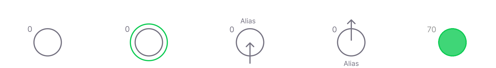

# Neuron

Neuron is the basic computational unit of the network. You can read the general overview here. We rely on WebGPU to allow for performant parallel computations on your machines GPU. You need to do some special steps to enable WebGPU support. In case it is not enabled, we fallback to a CPU version, but it is much less performant (actually up to 200 times slower🤖).

Neuron has 2 levels: the threshold level and modulation level. Threshold level is controlled by direct synapses, modulation level is controlled by modulator synapses.

Neurons can either create a single spike, or a spike train. In depends on the threshold overshoot.

After firing - neuron has a refractory period, meaning it wont react to any incoming signals and modify its levels.

Another important properties are adaptation and restoration. If during refractory period, neuron is stimulated too strong, it adapts to the level, increasing its threshold. Vise versa - if it does not get much stimulation, it reduces its level, in order to be more reactive.

Here is the list of neuron properties, that can be controlled on creation:

| Name                             | Type                 | Default                        | Description                                                                                                                                |
| -------------------------------- | -------------------- | ------------------------------ | ------------------------------------------------------------------------------------------------------------------------------------------ |
| `threshold`                    | `Int8` | `127`                    | Neurons default firing threshold.                                                                                                                       |
| `leak`              | `Int8`             | `20`                            | Rate at which the level is decreasing.                                                                                               |
| `modulationLeak`              | `Int8`             | `0`                          | Rate at which modulation level is returned to balance. If `0`, neuron is not sensitive to modulation.                                                                                          |
| `burstingRate`              | `Int8`             | `0`                          | If value is `> 0` and threshold is overshoot significantly before firing, neuron will respond with a spike train, instead of a single spike. If `0` - neuron always responds with a single spike.                                                                                             |
| `autoFiringRate`              | `Int16`             | `0`                          | Interval in milliseconds on how fast the neuron should be firing without any external stimulation. If `0`, autofiring is off.                                                                                               |
| `inputAlias`              | `String`             | `null`                          | If set, input will be marked as input (with an arrow) and be displayed in the circuit thumbnail accordingly.                                                                                           |
| `inputDescription`              | `String`             | `null`                          | Additional information, related to the input. In case you need to communicate something more.                                                                                               |
| `outputAlias`              | `String`             | `null`                          | If set, input will be marked as output (with an arrow) and be displayed in the circuit thumbnail accordingly.                                                                                           |
| `outputDescription`              | `String`             | `null`                          | Additional information, related to the output. In case you need to communicate something more.                                                                                               |

This properties can be used as a main characteristics of neurons. Chromo-modulation is a way to alter this properties. Modulation, the same way as regular level, can be either positive or negative, though there is a difference in level handling. For the activeLevel, the leak always moves the level to `0`. In case of modulation level, in moves to the balance: a center point, that can be displaced to either negative or positive side, depending on the modulation sum. For ex. if you modulate the threshold, and modulation level is shifted to negative, it increases the threshold, making neuron less responsive. And vise versa - if modulation is displaced to positive, threshold will be lower.

When accessed via engine API (for ex. in organ body), neuron exposes several methods:

Here is the list of neuron properties, that can be controlled on creation:

| Name                             | Type                 | Default                        | Description                                                                                                                                |
| -------------------------------- | -------------------- | ------------------------------ | ------------------------------------------------------------------------------------------------------------------------------------------ |
| `threshold`                    | `Int8` | `127`                    | Neurons default firing threshold.                                                                                                                       |

In order not to over complicate the code and editor, we move with rates, instead of static values, that can be tuned using sliders. In most cases, you dont need those precise values, the same way, those precision is not applicable to the biological nervous systems.