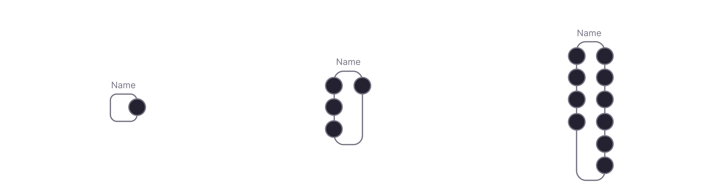

# Organ

It is an extension of the FLUX artificial nervous system that allows any off-circuit computations. In a nutshell, an organ can be thought of as an IO interface that receives a signal from the network in the form of spike trains, applies some arbitary operations, and/or propagates a signal to the network in the form of spike trains.

Neurons serve as the input and output interface for organs. The interface's structure is entirely up to the developer; depending on the use case, it may include any number of input and output neurons. An organ is simply a set of neurons and a computational unit that runs alongside the network at the engine level. 

In terms of structure, an organ is a piece of code that subscribes to an input neuron's activity and manipulates the output neuron's activity.

## Display

An organ thumbnail is displayed as a vertical frame, with output neurons on the right side and input neurons on the left:

## UI

Organs can have a UI. It is built with React JS. Structurally, it follows the pattern of React Components, using a reactive programming approach. If you are familiar with React.js, it should be intuitive.
## Organs rack

Active organs are displayed in the right pane of the editor. It is called an organ rack:

Each organ can be expanded or collapsed, exposing the interface (if it exists) and its settings, which can be modified on-the-fly.

## Creating custom organs

Organs are a regular node.js modules. The Organ module has 2 mandatory files:
### Definition
The root description of the organ. It creates a definition that would be displayed in the editor interface.

~~~js
interface OrganDefinition {
  /** Display name*/
  name: string;
  /** From the engine API, you will be able to call the organ by its alias*/
  alias: string;
  /** Current version in the form of "0.0.1" */
  version: string;
  /** Supported engine versions */
  engine: string;
  /** Path to repo if exists */
  git?: string;
  description?: string;

  /**
   * Returns an array of settings for the organ. This will be
   * used to collect user input for the organ before
   * being added to the circuit
   */
  getSettingsScheme?(): OrganSettingScheme[];

  /**
   * Returns an array of neurons, that should be created for the organ. Neurons serve as input and/or output
   * interface of the organ
   */
  getNeuronsScheme?(settings: any): any[];

  /** Returns an organ class, that would be created once the circuit is initialized, and added to the engine. */
  getOrganClass(): any;
}
~~~

In the `getSettingsScheme` you can define the settings that are needed to create an organ instance. Inside the settings body you can access the engine API, meaning that the settings can vary, depending on the circuit architecture if needed. This function returns an array of setting objects of the following form:
~~~js
interface OrganSetting {
  title: string;
  description?: string;
  name: string;
  /** Any built in javascript type */
  type: any;
  required: boolean;
  default: any;
}
~~~

This list is used as a schema for a form in the create organ dialog.

In `getNeuronsScheme` you define the neuronal interface of the organ. Later. you can subscribe to the firing of these neurons, or fire them programmatically from organ methods.

`getOrganClass` returns the actual Organ class, which contains organ logic.

### Organ class

Extend `Organ` base class, which includes the API to work with neurons, settings, and environment variables, provided in the definition and by the user in the moment of organ added to the circuit.

#### Methods

| Name                             | Type                                        | Description                                                                                                                                |
| -------------------------------- | -------------------- |  ------------------------------------------------------------------------------------------------------------------------------------------ |
| `initialize`                    | `() => void`                  | Runs on organ initialization. Should include the main organ logic.       |
| `setState`                    | `({ name: string, value: any }) => void`                  | Updates organ reactive state     |
| `onStateUpdate`                    | `(prevState: OrganState) => void`                  | Callback that runs on state update      |
| `cleanup`                    | `() => void`                  | Gets called when organ is removed from the engine.   |
| `render`                    | `() => React.Node`                  | Renders organ UI. Gets called on every state update. Returns a React.js node. You can use any React.js logic within this method       |
| `renderTitle`                    | `() => string`                  | Returns an organ title, that gets displayed in the organ rack       |

### Organ logic

Once the organ is added to the circuit, the `initialize` method is called. This is used to subscribe to its output and input neurons' events or any other events in the organ, like GraphQL subscriptions or API calls. It's up to you how to structure the code. You can import logic from other files or use NPM libraries. Here is the example:

~~~js
initialize = async () => {
    // Accessing organs neurons by alias
    this.subs.push(
        this.getNeuronByAlias('input_1').on('fire', (e: NeuronEvent) => {
            this.firingCount = this.firingCount + 1;
        })
    );
    // Accessing engine neurons. All the engine API is accessible inside the organ class
    this.subs.push(
        this.engine.getNeuronById('111').on('level_change', (e: NeuronEvent) => {
            this._neuronsData[e.target.id] = e.target.level;
        })
    );
    // Firing output neuron when promise resolves
    const result = await callSomeApi('https://api.url', { settings: this.settings });
    this._convertToSpikes(result);
};
~~~

Don't forget to provide cleanup function for cleanup logic and for canceling all active subscriptions.

~~~js
cleanup = () => {
    this.subs.forEach((s: Subscription) => s.remove());
};
~~~

## Interface

Organs can have an interface that is displayed in the organ rack of the editor. The interface is built as a React.js component.

Organs can define `render` method, which should return a React.js component:
~~~js
render = () => {
    return (
My fancy interface
);
};
~~~

As long as it is React.js, you can render everything that can be rendered using React.js. You can use any module inside the organs.

Sometimes the interface needs to be reactive to display the changes, get user input, etc. In this case, you can define the state of the organ. The state is reactive, meaning that whenever the state changes with `setState` method, the render method will be executed, and you will get an updated UI in the interface.
~~~js
state = {
    count: 1
};

increment = () => {
    // Don't worry about race conditions, the changes are sequential
    this.setState({ count: this.state.count + 1 });
};

render = () => {
    return (
        

            
Count: {this.state.count}

            <button onClick={increment}>Increment</button>
        
   
    );
};
~~~

If you need to run some action on a state update, you can use `onStateUpdate` method:

~~~js
state = {
    count: 1
};

onStateUpdate = (prevState) => {
    console.log(`It was ${prevState.count} and now it is ${this.state.count}`);
};

increment = () => {
    // Don't worry about race conditions, the changes are sequential
    this.setState({ count: count + 1 });
};

render = () => {
    return (
        

            
Count: {this.state.count}

            <button onClick={increment}>Increment</button>
        
   
    );
};
~~~

You can import various interface libraries, use canvas or svg in the render method. Organs need to be atomic and solve one thing at a time. If the logic is too complex, then they should be combined in a circuit. FLUX enforces keeping things modular.

## Environment variables

Organs have access to root circuit environment variables. For example, you might have a few organs, that control the robot's servo motors, and they all share the same IP address of your Arduino board. In this case, you can define an environment variable in the organ definition class. This will merge into the base circuit globals, and you can set it up there.

Then you can use it in the organ class under `env` namespace:
~~~js
setServoPosition = () => {
    this.send(this.env.ARDUINO_IP, { some: data })
};
~~~

## Publishing module

Modules can be packed as regular npm modules. In this case, they will be shared with the community and used by other developers. You can have any NPM dependencies you need, as organs are loaded dynamically into the editor. There can be organs that are related to sensors, actuators, that query APIs, perform some non-spiking ML, send data to other services, etc. The only limit is your imagination.

## Share organs

We highly encourage you to share organs with the FLUX community. This will be an investment into a growing ecosystem, that will help us achieve our common goa - transcend human intelligence for the prosperity of the mankind.

> **Solve intelligence, and then use that to solve everything else.** Demis Hassabis

