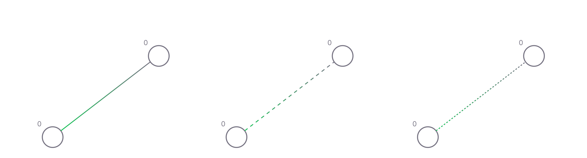

# Synapse

Synapses allow neurons to communicate with one another. It can be thought of as a channel of communication with a set of properties and a dynamic state. There are three types of synapses:

| Type                             | Description                 | 
| -------------------------------- | -------------------- |
| `Direct`                 | Alters the direct level of a neuron and causes it to fire in case the threshold is exceeded               |
| `Modulator`                             | Alters the modulation level of a neuron, which in turn alters a neuron's basic properties. Does not participate in direct firing            |
| `Electric`                             | Causes a neuron to fire unconditionally             |

In the editor interface, direct synapses are displayed as a line, connecting two neurons. The width of a synapse is proportional to its weight.
Synapses can have both positive and negative weight. If it is positive, it is colored green. If it is negative, it will be blue.
The gradient of the line indicates the direction: the color is more vivid closer to the emitter cell, and turns gray closer to the recipient cell.
Synapses can be subject to Hebbian spike timing dependent learning. The learned weight is displayed as a border of the line. If it is learned to a heavier weight, it is shown in white; otherwise, it is shown in yellow.

## Properties

| Name                             | Type                 | Default                        | Description                                                                                                                                |
| -------------------------------- | -------------------- | ------------------------------ | ------------------------------------------------------------------------------------------------------------------------------------------ |
| `synapseType`                    | `DIRECT`, `MODULATOR`, `ELECTRIC` | `DIRECT`                    | Synapse type defines the way it affects a neuron                                                                                                                |
| `weight`                    | `Int8` | `20`                    | Default synaptic weight. Can be altered by short-term and long-term memory mechanisms                                                                                                                       |
| `length`                    | `Int16` | `10`                    | The delay between the emitter neuron firing and its effect on the recipient neuron                                                                                                          |
| `stmRate`                    | `Int8` | `10`                    | Short-term memory rate. Determines synapse's ability to adapt its weight according to the STD process. Does not persist                                                                                                 |
| `ltmRate`              | `Int8`             | `20`                            |Long-term memory rate. Determines synapse's ability to persistently change its weight according to the STD learning process and modulation                                                                                         |

