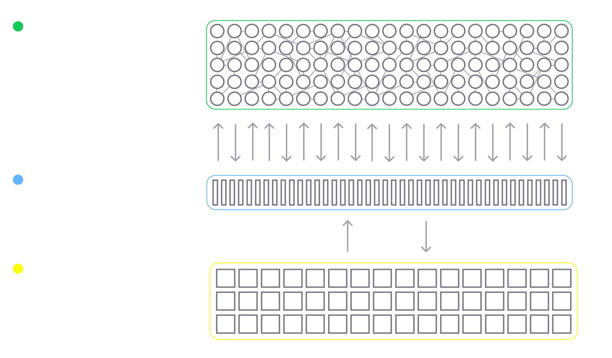
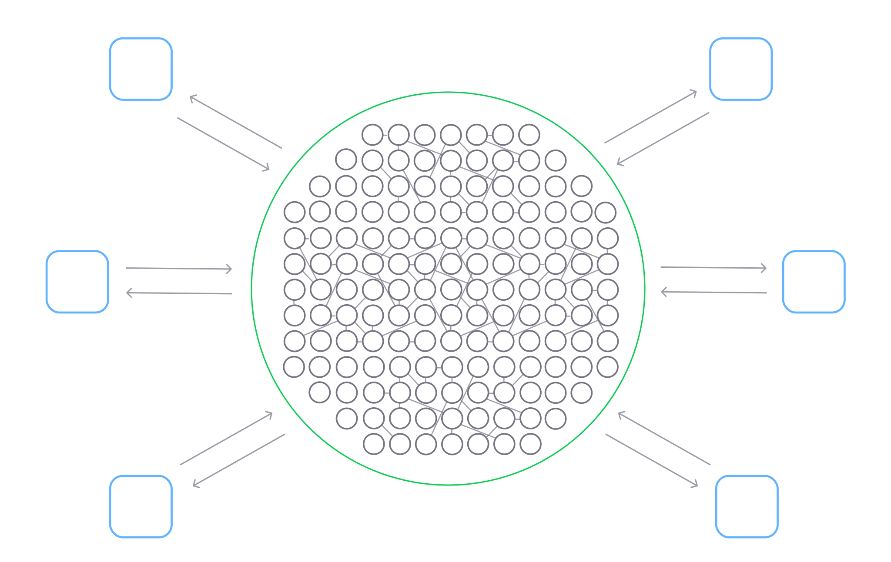

# Implementation overview

FLUX engine is implemented in `Typescript`, `Rust` and `WebGPU Shading Language`. It runs as a browser application and utilizes `WebAssembly` and `WebGPU` standards to maximize performance. These architectural decisions give FLUX a number of advantages:
* platform independence
* computational efficiency
* horizontal scalability
* peer-to-peer communication out-of-box 

## Engine

The engine consists of 3 core parts:

**Neurons graph** is a flat list of neurons in the system, with their states, properties, and connections. It is implemented in `WebAssembly` and `Rust`, to guarantee efficient memory usage. This utilizes RAM. To save memory, we try to keep most of the numeric values in the Uint8 type.

**Computational core** is where the neuronal processing happens. Computations happen when a neuron accepts a stimulus over incoming synapses. It determines whether it needs to be fired or not, by comparing its state and properties. with respect to time, and updates its state. This runs on the GPU, via `WebGPU` and `WebGPU Shading Language`.

**Event loop** is something that maintains the action potential processing and orchestrates the activity of the network. It is implemented in `Typescript`, which has an event loop implementation in its core and utilizes the CPU. Modern Javascript engines like Google's V8 have outstanding performance, very close to compiled languages.

There is still a lot of ongoing work in terms of engine improvements. Our goal is to be able to run a network of 10 billion neurons on a regular laptop. Another thing we should keep in mind is the future usage of [neuromorphic chips](https://en.wikipedia.org/wiki/Neuromorphic_engineering).

## Non-neuronal computations

Any software system does some I/O, meaning it should accept input and generate output. FLUX has a very powerful extension mechanism that allows you to send input to the network, read its output, and perform non-neuronal computations.

We call these extensions "organs". It can be treated as a piece of code that runs alongside the network and has connections to neurons via the Engine API. In addition to this, organs can have an interface in the editor. You can create your own organs for FLUX. In some time, we expect a big ecosystem of extensions that will fit any need.

## Core components and terminology

| Name                             | Description                 | 
| -------------------------------- | -------------------- |
| **Circuit**                 | A circuit is a functionally complete set of neurons and the connections between them. It is the main building block of FLUX artificial nervous systems. A circuit can contain nodes, like neurons, organs, and other circuits. Circuits can be saved as prototypes, grouped, nested, and inherited by other circuits. Intelligent circuit hierarchies can be beneficial in terms of network maintainability and growth.             |
| **Neuron**                             | A neuron is the basic computational unit of FLUX. It implements a leaky modulated integrate-and-fire neuron model, with habituation and potentiation properties. On firing, a neuron can either emit a single spike or a spike train, depending on the threshold overshoot.         |
| **Synapse**                             | A synapse is the connection between two neurons. Synapse weight determines the level of influence on the target neuron. The weight sign determines whether the synapse is inhibitory or excitatory. There are three types of synapses: direct, modulator, and electric. Synapses can be plastic and change their weight in the process of Hebbian learning. Learning is mediated by firing activity and modulation.         |
| **Organ**                             | Organ is a code that runs along with the engine and utilizes neurons as its input and output interface. Input organs accept signals in the form of input neuron's spikes. Organs generate an output in the form of spikes via their output neurons.        |
