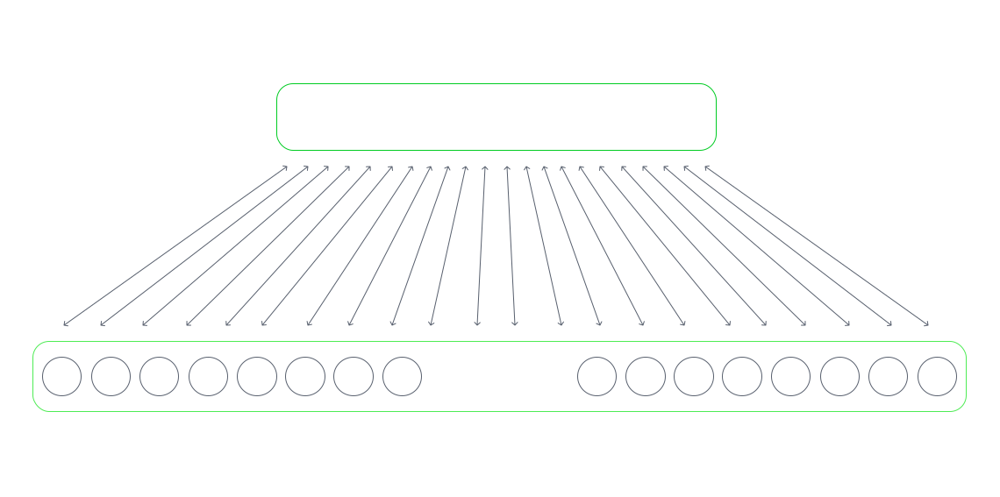

# Architecture overview

Knowing the fact that only 2% on brain neurons are actually active, to optimize memory usage of the pub-sub, the process of mounting and unmounting neurons can be dynamic. Our goal is to be able to run a network of 10 billion neurons on a regular laptop. And extend it by any number of devices on network with Flux Macro RTC protocol and/or add remote VPS servers on demand. So that researches are not limited in scale.
## Technical overview

The basic computation unit is neuron. Neurons logic uses WebGPU to move this to your machines GPU. Once neuron fires, it sends an event via PubSub mechanism.
## Components
### Circuit

Circuit is a functionally closed set of neurons and connections between them. It is the main component of FLUX. It can contain various nodes, like neurons, organs and another circuits and connections between them. You can easily create circuits out of current networks and create deep nested architectures. Circuits can be saved to prototypes, and inherited by another circuits from the explorer. Circuits can be duplicated and grouped, so it is easy to make modifications (for example the control of the hexapod leg). Think of it as a basic building block of your artificial nervous system.

Splitting complex network in component helps to keep the interface clean, readable and observable. On the engine level, it all converges to flat graph of neurons, that fire each other through synapses, so nesting does not add any complexity to the computations.

### Components

Nodes are the builing blocks of the circuits. Each circuit can be a node of another circuit, alongside with neurons and organs.

#### Neuron

Neuron is the basic computational unit of the system. Currently it follows the Belkin-Kaygorodov Leaky linear Neuron is described here. Ling story short - think of it as a reservour with liquid, and each synapse either adds liquid to reservour (excites), our take it out (inhibits). Apart from thius, there is always a leak, so the liquid level is decreasing. If a level of liquid exceed a certain threshold, the neuron fires: meaning it propagates the signals through all of its synapses.

#### Synapse

Synapse is the connection between neurons. Each synapse has a weight. In the reservour/liquid neuron anology, it can be thought of as an amount of liquid. Synapses can either excite or inhibit neuron. This is determined by the sign of the weight, that can either be positive or negative.

There are three types of synapses: direct, modulator and electric. Direct synapses either add or sutract from neurons active level. Modulative sinapses do not affect the level firectly, but modify neurons properties, like threshold or learning. Electric synapse just unconditionally makes the neuron fire.

#### Organ

Organ is a way to extend the circuit functionality by adding non-neuronal computation. There can be input, output or mixed organs. Ograns communicate with the circuit using neuron interface. Input organs receive spike trains with its input neurons, and do arbitaty computations with the data. Output organs serialize its data into the spike trains and send it over its output neural interface. You can do whatever you want in the organ body, it is not limited. Organs can have an interface.

### Engine

Engine is the global api, that can be accessible in organs. By this it can read the activity of the whole network and manipulate this.