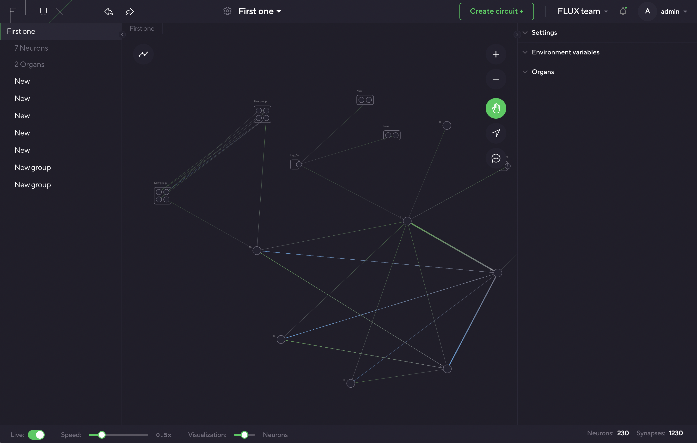
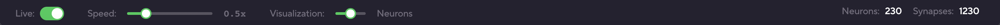
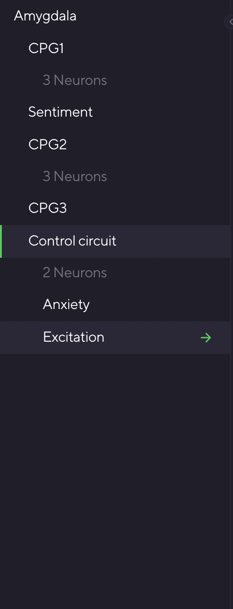
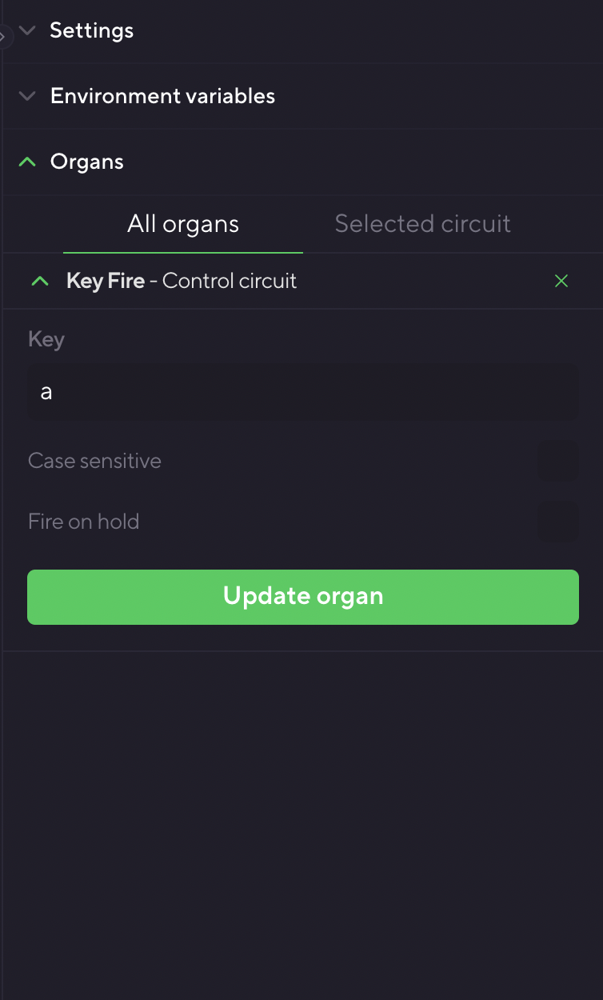
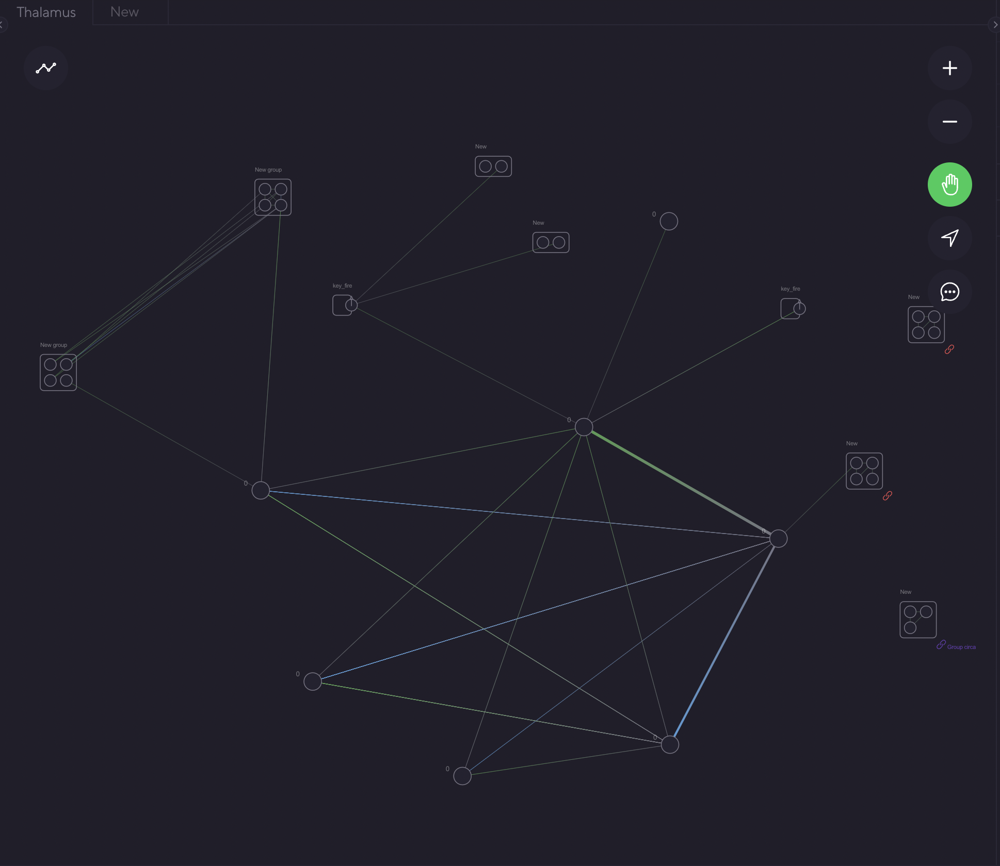
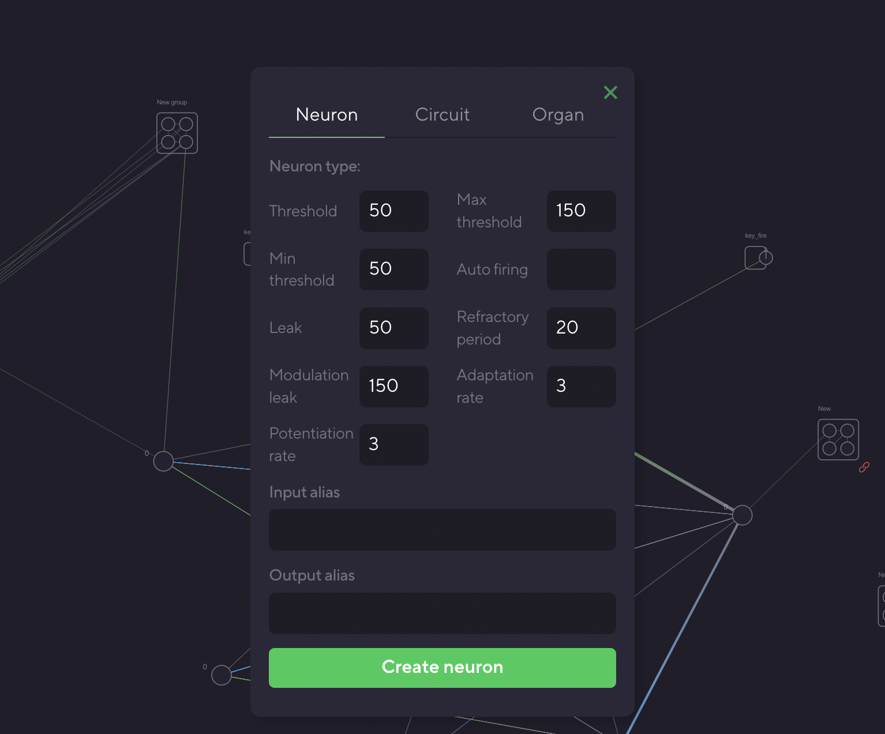
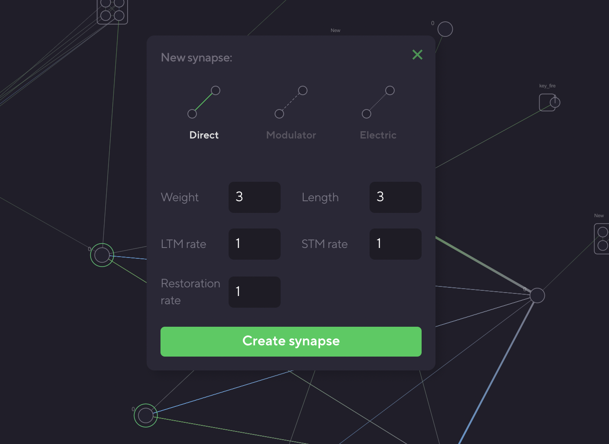
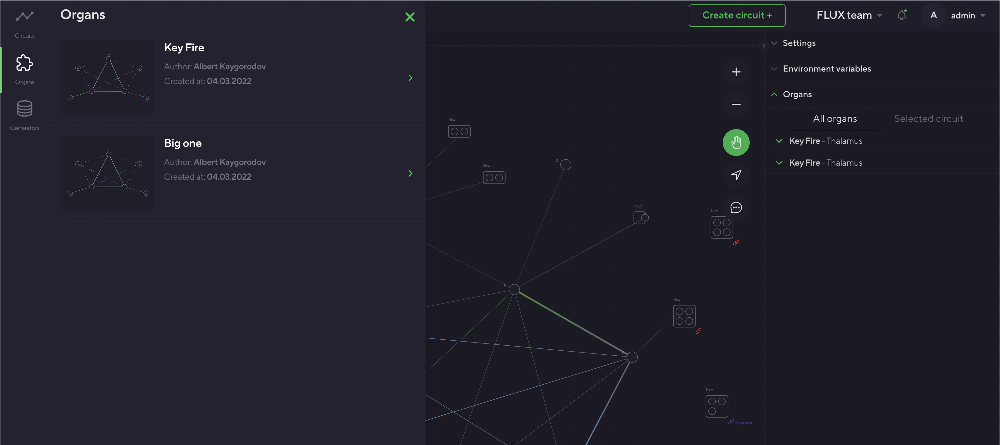
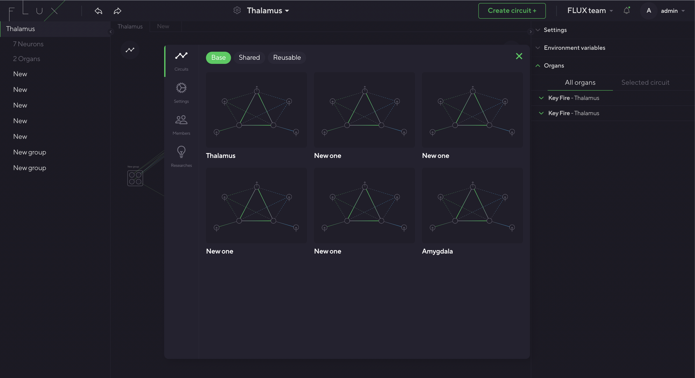

# Flux editor

The editor is a simple and intuitive, yet powerful graphical interface for creating artificial nervous systems of any complexity. It is built to reinforce modular, component-based neuronal systems. It encourages splitting complex networks into functional circuits and building multi-level hierarchies by nesting and grouping components. Rich visual feedback allows us to analyze the nervous system dynamics in real time.

Let's dive into the main interface. If you are familiar with coding IDEs like VSCode, this would be very familiar and intuitive for you.

## Main Window
This is the main editor interface. 

### Top controls
Here you have global controls, like managing your account and organization, creating new circuits, and accessing the components explorer.

### Bottom controls
This lets you control the execution of the current network. 

### Circuit Tree
This displays the hierarchy of the current network. You can open sub-circuits in the new tabs or highlight them.

<!--  -->

### Organs rack
Here you have a list of the organs connected to the current network, and the corresponding organ UI and settings. Organs can be expanded, collapsed, or filtered.

<!--  -->

## Editor
This is the main network editing interface. Think of it as Figma for designing nervous systems.

There are three modes: edit mode, selection mode, and comment mode.

Click on any place on the canvas to create a new node: neuron, circuit, or organ, and set corresponding properties.

To create a synapse, select a source neuron by clicking it, and then choose a target neuron. This will open a new synapse dialog.

Right-click on each node to open an edit dialog. You can also edit synapses by selecting two connected neurons.

You can remove nodes either from the dialog menu or by selecting nodes and hitting backspace. All the corresponding synapses will be removed.

Hold and drag nodes to arrange the network graph. You can also look for the guides to keep the structure organized.
## Explorer
In the explorer, you can access various community networks, organs, and generators, and use them in your current network.

## Organization settings
Edit your organization page, access all your projects, manage members and access rights.

## Comments
You can leave comments at any point in the network graph. By clicking the comment, you can open a discussion thread.