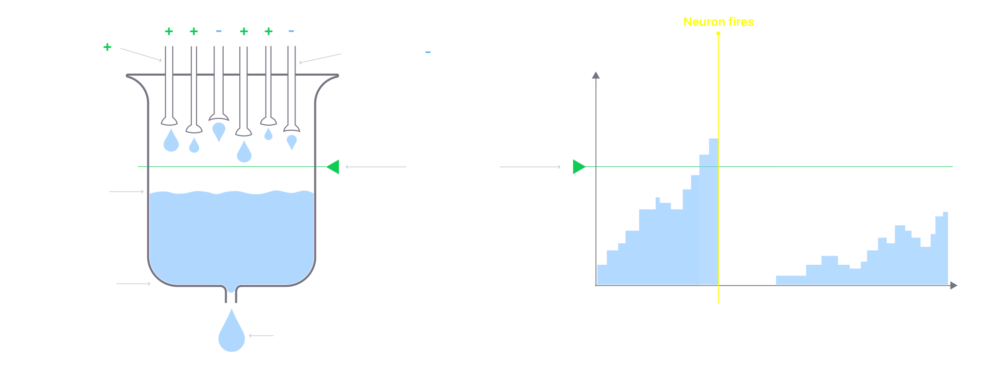
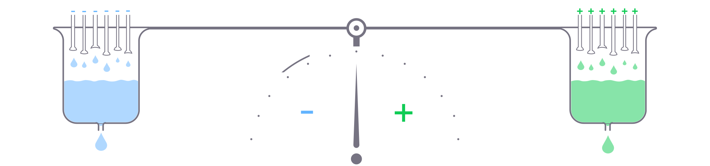
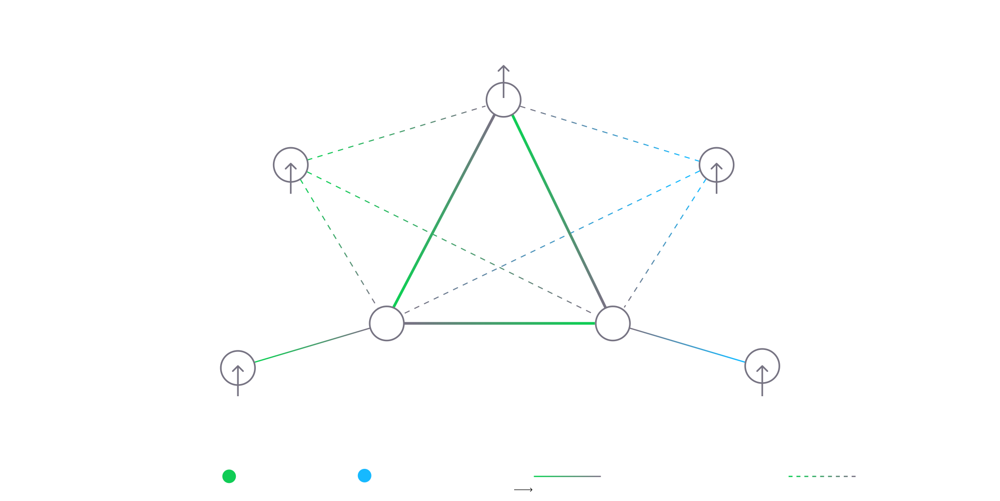

# Neural model overview

FLUX engine follows a custom implementation of a modulated spiking neural network model that aims to maintain a perfect balance between biological accuracy and computational performance. This model reduces the biological nervous system to its core functional features, avoiding unnecessary complexity. The model is computationally efficient yet expressive and biologically accurate. Its simplicity and linearity make it easy to implement this in hardware. Let's dive into its essential components:

## Leaky modulated integrate-and-fire neuron

A neuron in the model works as a simple summator. It ignores the complex electrodynamic properties in favor of its functional essence and computational efficiency. A neuron in the model can be represented as a leaky vessel with liquid:

Each incoming synapse adds or subtracts some liquid from the vessel. While liquid also leaks from the vessel at a constant rate, that is controlled by a `leak` property. Once the level of a liquid reaches a certain `threshold`, a neuron fires a spike, meaning it propagates a signal over all of its active synapses, so they affect the "liquid levels" of other neurons. After a spike, the level drops to the baseline and the neuron enters a `refractory period`, during which the neuron ignores all incoming signals.
If the level of a neuron overshoots the threshold by a significant amount, it can burst a series of spikes.

If too many signals come in during the refractory period, it increases its threshold. This process is called habituation and is defined by `habituation rate`.

Vice-verse, if a neuron does not receive stimulation for a long time, it decreases its threshold. This process is called potentiation, and is defined by `potentiation rate`.

Apart from the level mechanism that is mediated by `direct synapses`, neurons have a modulation mechanism that is controlled by `modulatory synapses`. The modulation level does not participate in direct firing but alters the neuron properties, like threshold and learning rate.
Modulation also has its level, but it acts a bit differently: the modulation level gets back to balance at a certain rate, and modulation synapses are displacing the balance to either the negative or positive side:

In cases where the modulation sum is negative, it dampens the related properties. For example, if the threshold is modulated, it will temporarily increase it if the modulation level is shifted to the negative, so the neuron gets less responsive. Otherwise, if modulation sum is positive, it lowers its threshold, and neurons become more responsive. If the modulation level is balanced, it does not have any effect.

## 3 types of synapses

The model has three types of synapses, inspired by its biological counterparts:
* `Direct`. This type of synapse either inhibits a target neuron or excites it. In the vessel with a liquid analogy, they either increase the liquid level, or decrease it by its weight. Its biological analogy can be thought of as glutamate or GABA synapses.
* `Modulator`. Does not affect the neuron firing directly but alters its properties, like threshold, adaptation rate, etc. This is inspired by various neuromodulators in the brain, like dopamine, serotonin, and noradrenalin, but reduced to a single type of synapse.
* `Electric`. Makes a target neuron fire unconditionally, bypassing the summation process. In biology, this is represented by a soma synapses that passes discharge right to another neuron's membrane.

Synapse has a weight that can be thought of as a "pipe diameter". If a synapse is `plastic`, weight can be altered, either temporarily or persistently, by the mechanisms of short-term and long-term memory.

Here is a simple implementation of a basic adjustable [Central Pattern Generator](https://en.wikipedia.org/wiki/Central_pattern_generator):

In this minimalist network, the generator produces rhythmic output at a certain frequency. By modulating generator neurons, we can manipulate the output frequency of the generator. In the real world example, this can be a network that maintains a robot's level or arousal.

## Short and long term memory

Short-term and long-term memory implementations are based on spike timing-dependent Hebbian processes. It maintains a "tail" of neuronal activity, which is basically a registry of recently active neurons with a timestamp, and in case the neuron fires just before another neuron, model increases the synaptic weight of the connecting synapse. In the event that the neuron fires just before another neuron, it decreases synaptic weight. This is an implementation of the well-known Hebbian postulate: 
> Neurons that fire together, wire together. Neurons that fire apart, wire apart. 

Depending on the neuron type, plasticity can happen only when two neurons are connected by a synapse or if they are related topologically.

Plasticity is also a target for modulation. Modulation is the major tool for persisting the weight change, "moving" memory from the short-term to the long-term.

## Asynchronous execution 

There is no central clock in the network. Each neuron manages its own timing. The only thing that synchronizes the network is the firing of neurons. Inconsistencies in the event loop add a natural noise to the network dynamics.

