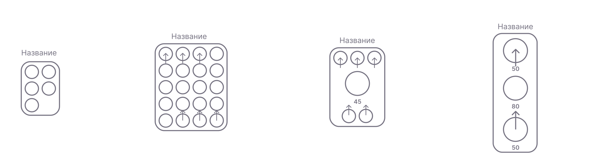

# Схема

Цепь — это совокупность узлов (нейронов, органов, других цепей) и связей между ними. На уровне движка он представлен в виде плоского набора нейронов и синапсов. Схемы можно группировать, вкладывать, совместно использовать и сохранять как прототипы. Это мощный инструмент для построения многоуровневых систем с использованием методологии проектирования компонентов. Корневая схема — это схема верхнего уровня, выполняемая вычислительным ядром движка.

## Отображать
Цепи отображаются как набор нейронов, расположенных в сетке в пределах границы цепи. В зависимости от количества нейронов эскизы цепей отображаются по-разному:

Входные и выходные нейроны показаны вверху и внизу миниатюры соответственно.
## Характеристики

| Имя | Тип | По умолчанию | Описание |
| -------------------------------- | -------------------- | ------------------------------ | -------------------------------------------------- -------------------------------------------------- -------------------------------------- |
| `заголовок` | `Строка` | "" | Отображаемое имя цепи |
| `описание` | `Строка` | "" | Строка уценки |
| `многоразовый` | `булево` | `ложь` | Если true, схема появится в проводнике как повторно используемый компонент |
| `общий` | `булево` | `ложь` | Если true, схема будет доступна другим пользователям в глобальном проводнике. |

## Создание цепей

Вы можете создать цепь, выбрав нейроны с помощью инструмента выбора и указав свойства цепи в диалоговом окне:

Корневые цепи можно создать, нажав «+ Create» в заголовке редактора.

## Вложенные схемы

Схемы могут быть узлами других схем. Мы настоятельно рекомендуем поддерживать чистоту и наглядность ваших цепей, предоставляя входные и выходные нейроны. Дерево узлов корневой цепи можно просмотреть на левой панели. Вы можете расширять и сворачивать узлы, а также открывать их в новой вкладке редактора.

## Группировка цепей

Иногда вам нужно сгруппировать ваши каналы, чтобы изменения в одном канале распространялись на все остальные в группе. Это можно сделать, выбрав схему и войдя в режим группировки. Другой вариант: при клонировании схемы установить опцию `pair`.
## Наследование цепей

Создав цепь, в настройках вы можете сделать ее многоразовой:

Теперь он будет доступен в проводнике, так что вы сможете использовать его как прототип для других схем. Просто перетащите его на панель редактора и выберите, нужно ли его расширить или добавить как узел.

## Корневая цепь

Помимо того же набора функций, что и у обычного канала, корневой канал включает в себя дополнительные свойства, такие как глобальные переменные среды, которые можно использовать внутри его узлов.

## Файлы схемы

Данные схемы хранятся в двоичном файле с расширением .flx. Файлы хорошо оптимизированы для обеспечения оптимального размера и возможности переноса в другие системы. В случае зависимости от органов их также можно портировать как исполняемые файлы с помощью wasm и загружать в любую автономную систему.