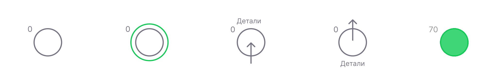

# Нейрон

Фундаментальной вычислительной единицей искусственных нервных систем FLUX является нейрон. Мы полагаемся на WebGPU для выполнения быстрых параллельных вычислений на любой машине. Чтобы сделать поддержку WebGPU доступной, необходимо выполнить некоторые специальные действия. Мы возвращаемся к версии CPU, если она не включена, хотя она значительно менее эффективна (до 200 раз медленнее).

Нейрон имеет 2 внутренних «уровня»: пороговый уровень и уровень модуляции. Пороговый уровень контролируется «прямыми» синапсами, тогда как уровень модуляции контролируется «модулирующими» синапсами.

При возбуждении нейрон может генерировать либо одиночный спайк, либо серию спайков. Это зависит от превышения порога.

После возбуждения нейрон вступает в рефрактерный период, то есть он не будет реагировать ни на какие входящие сигналы.

Другими важными свойствами являются адаптация и потенциация. Если нейрон слишком сильно стимулировать в рефрактерный период, он повысит свой порог. Этот процесс называется «адаптацией», и он очень важен для стабильности сети. Если нейрон не получает сильной стимуляции в течение длительного времени, он снижает свой порог, чтобы быть более реактивным. Этот процесс называется «потенциированием».

## Характеристики

| Имя | Тип | По умолчанию | Описание |
| -------------------------------- | -------------------- | ------------------------------ | -------------------------------------------------- -------------------------------------------------- -------------------------------------- |
| `порог` | `Int8` | `127` | Порог срабатывания по умолчанию. |
| `утечка` | `Int8` | `20` | Скорость снижения уровня. |
| `утечка модуляции` | `Int8` | `0` | Скорость, с которой уровень модуляции возвращается к равновесию. Если «0», нейрон не чувствителен к модуляции. |
| `скорость разрыва` | `Int8` | `0` | Если значение «> 0» и порог значительно превышен перед срабатыванием, нейрон ответит серией спайков вместо одиночного спайка. Если `0, нейрон всегда отвечает одним импульсом. |
| `autoFiringRate` | `Int16` | `0` | Интервал в миллисекундах, определяющий частоту возбуждения нейрона без какой-либо внешней стимуляции. Если `0`, автоматическая стрельба отключена. |
| `вводной псевдоним` | `Строка` | `нулевой` | Нейрон будет обозначен как вход, если установлен (со стрелкой, указывающей внутрь, и псевдонимом). |
| `входное описание` | `Строка` | `нулевой` | Дополнительная информация, связанная с вводом, будет отображаться при наведении. |
| `выходной псевдоним` | `Строка` | `нулевой` | Нейрон будет обозначен как выход, если установлен (со стрелкой, указывающей наружу, и псевдонимом) |
| `выходное описание` | `Строка` | `нулевой` | Дополнительная информация, связанная с выводом, будет отображаться при наведении. |

Эти свойства используются в качестве характеристик нейрона по умолчанию. Модуляция — это способ изменить эти свойства. Уровень модуляции, как и обычный уровень, может быть как положительным, так и отрицательным, хотя есть разница в обработке уровня: для прямого уровня «утечка» всегда снижает уровень до «0». В случае уровня модуляции он ищет баланс: центральную точку. Модуляция смещается либо в отрицательную, либо в положительную сторону входящими «модуляторными синапсами». Например, если порог модулируется и уровень модуляции изменяется на отрицательный, активный порог повышается, и нейрон становится менее чувствительным. Порог будет уменьшен, если модуляция смещена в положительную сторону.

При доступе через API движка (например, в теле органа) нейрон предоставляет несколько методов.

## Методы

| Имя | Тип | Описание |
| -------------------------------- | -------------------- | -------------------------------------------------- -------------------------------------------------- -------------------------------------- |
| `огонь` | `() => пустота` | Излучает спайк, активируя все эфферентные синапсы |
| `суммирование` | `(вес: число) => пустота` | Добавляет вес прямому уровню нейронов и инициирует перерасчет |
| `модулировать` | `(вес: число) => пустота` | Добавляет вес уровню модуляции нейронов и инициирует перерасчет |
| `обновление` | `(neuron: NeuronType) => void` | Обновляет свойства нейронов в режиме реального времени |
| `обновлениеSynapse` | `(синапс: SynapseType) => недействительным` | Обновляет свойства синапсов нейронов в режиме реального времени |
| `получить афференты` | `() => [SynapseType]` | Возвращает список всех афферентных (входящих) синапсов |
| `получить эффекты` | `() => [SynapseType]` | Возвращает список всех эфферентных (исходящих) синапсов |

Чтобы не усложнять код и редактор, мы перемещаемся с рейтами вместо статических значений, которые можно настроить с помощью ползунков. В большинстве случаев вам не нужен такой уровень точности. В биологических сетях также не так много точности.