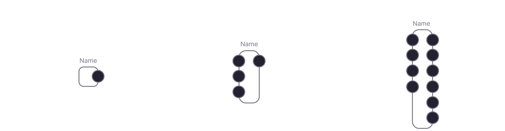

# Орган

Это расширение искусственной нервной системы FLUX, позволяющее выполнять любые вычисления вне схемы. В двух словах, орган можно рассматривать как интерфейс ввода-вывода, который получает сигнал из сети в виде последовательности импульсов, выполняет некоторые произвольные операции и/или распространяет сигнал в сети в виде последовательности импульсов.

Нейроны служат входным и выходным интерфейсом для органов. Структура интерфейса полностью зависит от разработчика; в зависимости от варианта использования он может включать любое количество входных и выходных нейронов. Орган — это просто набор нейронов и вычислительная единица, работающая вместе с сетью на уровне движка.

С точки зрения структуры орган — это фрагмент кода, который подписывается на активность входного нейрона и манипулирует активностью выходного нейрона.

## Отображать

Миниатюра органа отображается в виде вертикальной рамки с выходными нейронами справа и входными нейронами слева:

## Пользовательский интерфейс

Органы могут иметь пользовательский интерфейс. Он построен с помощью React JS. Структурно он следует образцу React Components, используя подход реактивного программирования. Если вы знакомы с React.js, он должен быть интуитивно понятен.
## Стойка для органов

Активные органы отображаются в правой панели редактора. Это называется органной стойкой:

Каждый орган можно развернуть или свернуть, открывая интерфейс (если он существует) и его настройки, которые можно изменять на лету.

## Создание пользовательских органов

Органы — это обычные модули node.js. Модуль Organ имеет 2 обязательных файла:
### Определение
Корневое описание органа. Он создает определение, которое будет отображаться в интерфейсе редактора.

~~~js
interface OrganDefinition {
  /** Display name*/
  name: string;
  /** From the engine API, you will be able to call the organ by its alias*/
  alias: string;
  /** Current version in the form of "0.0.1" */
  version: string;
  /** Supported engine versions */
  engine: string;
  /** Path to repo if exists */
  git?: string;
  description?: string;

  /**
   * Returns an array of settings for the organ. This will be
   * used to collect user input for the organ before
   * being added to the circuit
   */
  getSettingsScheme?(): OrganSettingScheme[];

  /**
   * Returns an array of neurons, that should be created for the organ. Neurons serve as input and/or output
   * interface of the organ
   */
  getNeuronsScheme?(settings: any): any[];

  /** Returns an organ class, that would be created once the circuit is initialized, and added to the engine. */
  getOrganClass(): any;
}
~~~

В `getSettingsScheme` вы можете определить настройки, необходимые для создания экземпляра органа. Внутри тела настроек вы можете получить доступ к API движка, а это означает, что настройки могут варьироваться в зависимости от архитектуры схемы, если это необходимо. Эта функция возвращает массив объектов настройки следующего вида:
~~~js
interface OrganSetting {
  title: string;
  description?: string;
  name: string;
  /** Any built in javascript type */
  type: any;
  required: boolean;
  default: any;
}
~~~

Этот список используется как схема для формы в диалоге создания органа.

В `getNeuronsScheme` вы определяете нейронный интерфейс органа. Потом. вы можете подписаться на срабатывание этих нейронов или запускать их программно из методов органов.

`getOrganClass` возвращает фактический класс Organ, который содержит логику органа.

### Органный класс

Расширьте базовый класс Organ, который включает в себя API для работы с нейронами, настройками и переменными среды, предоставленными в определении и пользователем в момент добавления органа в схему.

#### Methods

| Name                             | Type                                        | Description                                                                                                                                |
| -------------------------------- | -------------------- |  ------------------------------------------------------------------------------------------------------------------------------------------ |
| `initialize`                    | `() => void`                  | Runs on organ initialization. Should include the main organ logic.       |
| `setState`                    | `({ name: string, value: any }) => void`                  | Updates organ reactive state     |
| `onStateUpdate`                    | `(prevState: OrganState) => void`                  | Callback that runs on state update      |
| `cleanup`                    | `() => void`                  | Gets called when organ is removed from the engine.   |
| `render`                    | `() => React.Node`                  | Renders organ UI. Gets called on every state update. Returns a React.js node. You can use any React.js logic within this method       |
| `renderTitle`                    | `() => string`                  | Returns an organ title, that gets displayed in the organ rack       |

### Organ logic

Как только орган добавлен в схему, вызывается метод «инициализация». Это используется для подписки на события его выходных и входных нейронов или любые другие события в органе, такие как подписки GraphQL или вызовы API. Вам решать, как структурировать код. Вы можете импортировать логику из других файлов или использовать библиотеки NPM. Вот пример:

~~~js
initialize = async () => {
    // Accessing organs neurons by alias
    this.subs.push(
        this.getNeuronByAlias('input_1').on('fire', (e: NeuronEvent) => {
            this.firingCount = this.firingCount + 1;
        })
    );
    // Accessing engine neurons. All the engine API is accessible inside the organ class
    this.subs.push(
        this.engine.getNeuronById('111').on('level_change', (e: NeuronEvent) => {
            this._neuronsData[e.target.id] = e.target.level;
        })
    );
    // Firing output neuron when promise resolves
    const result = await callSomeApi('https://api.url', { settings: this.settings });
    this._convertToSpikes(result);
};
~~~

Не забудьте предоставить функцию очистки для очистки логики и для отмены всех активных подписок.

~~~js
cleanup = () => {
    this.subs.forEach((s: Subscription) => s.remove());
};
~~~

## Interface

Органы могут иметь интерфейс, который отображается в стойке органов редактора. Интерфейс построен как компонент React.js.

Органы могут определить метод `render`, который должен возвращать компонент React.js:
~~~js
render = () => {
    return (
My fancy interface
);
};
~~~

Пока это React.js, вы можете отображать все, что можно отобразить с помощью React.js. Вы можете использовать любой модуль внутри органов.

Иногда интерфейс должен быть реактивным для отображения изменений, получения пользовательского ввода и т. д. В этом случае вы можете определить состояние органа. Состояние является реактивным, что означает, что всякий раз, когда состояние изменяется с помощью метода `setState`, будет выполняться метод рендеринга, и вы получите обновленный пользовательский интерфейс в интерфейсе.
~~~js
state = {
    count: 1
};

increment = () => {
    // Don't worry about race conditions, the changes are sequential
    this.setState({ count: this.state.count + 1 });
};

render = () => {
    return (
        

            
Count: {this.state.count}

            <button onClick={increment}>Increment</button>
        
   
    );
};
~~~

сли вам нужно выполнить какое-то действие при обновлении состояния, вы можете использовать метод `onStateUpdate`:

~~~js
state = {
    count: 1
};

onStateUpdate = (prevState) => {
    console.log(`It was ${prevState.count} and now it is ${this.state.count}`);
};

increment = () => {
    // Don't worry about race conditions, the changes are sequential
    this.setState({ count: count + 1 });
};

render = () => {
    return (
        

            
Count: {this.state.count}

            <button onClick={increment}>Increment</button>
        
   
    );
};
~~~

Вы можете импортировать различные библиотеки интерфейсов, использовать canvas или svg в методе рендеринга. Органы должны быть атомарными и решать одну задачу за раз. Если логика слишком сложная, то их следует объединить в схему. FLUX требует модульности.

## Переменные среды

Органы имеют доступ к переменным среды корневого контура. Например, у вас может быть несколько органов, которые управляют серводвигателями робота, и все они имеют один и тот же IP-адрес вашей платы Arduino. В этом случае вы можете определить переменную среды в классе определения органа. Это будет объединено с глобальными параметрами базовой схемы, и вы можете настроить их там.

Затем вы можете использовать его в классе органов в пространстве имен `env`:
~~~js
setServoPosition = () => {
    this.send(this.env.ARDUINO_IP, { some: data })
};
~~~

## Модуль публикации

Модули могут быть упакованы как обычные модули npm. В этом случае они будут переданы сообществу и использованы другими разработчиками. У вас могут быть любые зависимости NPM, которые вам нужны, так как органы динамически загружаются в редактор. Могут быть органы, связанные с датчиками, исполнительными механизмами, которые запрашивают API-интерфейсы, выполняют какое-то машинное обучение без всплесков, отправляют данные в другие службы и т. д. Единственным ограничением является ваше воображение.

## Доля органов

Мы настоятельно рекомендуем вам делиться органами с сообществом FLUX. Это будет инвестиция в растущую экосистему, которая поможет нам достичь нашей общей цели - превзойти человеческий разум для процветания человечества.

> **Разгадывайте разведданные, а затем используйте их, чтобы решать все остальное.** Демис Хассабис

