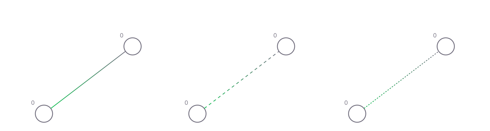

# Синапс

Синапсы позволяют нейронам общаться друг с другом. Его можно рассматривать как канал связи с набором свойств и динамическим состоянием. Существует три типа синапсов:

| Тип | Описание |
| -------------------------------- | -------------------- |
| `Прямой` | Изменяет прямой уровень нейрона и вызывает его срабатывание в случае превышения порога |
| `Модулятор` | Изменяет уровень модуляции нейрона, что, в свою очередь, изменяет основные свойства нейрона. Не участвует в стрельбе прямой наводкой |
| `Электрик` | Заставляет нейрон срабатывать безоговорочно |

В интерфейсе редактора прямые синапсы отображаются в виде линии, соединяющей два нейрона. Ширина синапса пропорциональна его весу.
Синапсы могут иметь как положительный, так и отрицательный вес. Если он положительный, он окрашивается в зеленый цвет. Если он отрицательный, он будет синим.
Градиент линии указывает направление: ближе к излучающей ячейке цвет становится более ярким, а ближе к принимающей - становится серым.
Синапсы могут подвергаться обучению, зависящему от времени спайка Хебба. Заученный вес отображается в виде границы линии. Если он обучен более тяжелому весу, он отображается белым цветом; в противном случае он отображается желтым цветом.

## Характеристики

| Имя | Тип | По умолчанию | Описание |
| -------------------------------- | -------------------- | ------------------------------ | -------------------------------------------------- -------------------------------------------------- -------------------------------------- |
| `тип синапса` | `ПРЯМОЙ`, `МОДУЛЯТОР`, `ЭЛЕКТРИЧЕСКИЙ` | `ПРЯМОЙ` | Тип синапса определяет способ его воздействия на нейрон |
| `вес` | `Int8` | `20` | Синаптический вес по умолчанию. Может быть изменен механизмами кратковременной и долговременной памяти |
| `длина` | `Int16` | `10` | Задержка между срабатыванием нейрона-эмиттера и его влиянием на нейрон-реципиент |
| `stmRate` | `Int8` | `10` | Скорость кратковременной памяти. Определяет способность синапса адаптировать свой вес в соответствии с процессом STD. Не сохраняется |
| `ltmRate` | `Int8` | `20` | Частота долговременной памяти. Определяет способность синапса постоянно изменять свой вес в соответствии с процессом обучения STD и модуляцией |