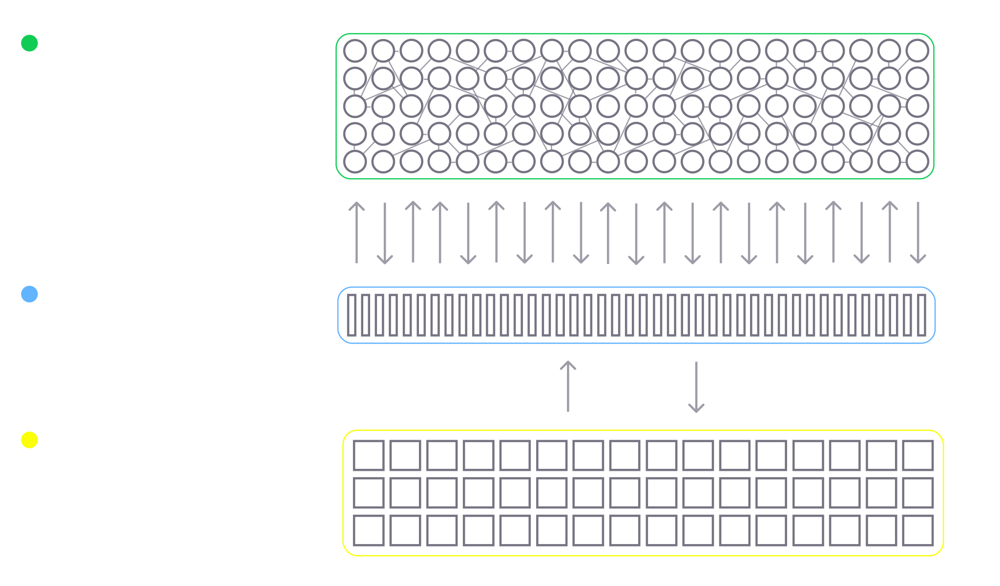
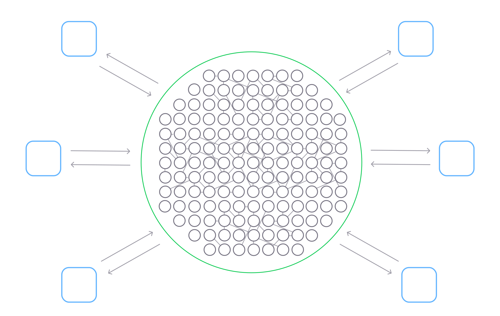

# Обзор реализации

Движок FLUX реализован на Typescript, Rust и WebGPU Shading Language. Он работает как браузерное приложение и использует стандарты WebAssembly и WebGPU для максимальной производительности. Эти архитектурные решения дают FLUX ряд преимуществ:
* независимость от платформы
* вычислительная эффективность
* горизонтальная масштабируемость
* одноранговая связь из коробки

## Двигатель

Двигатель состоит из 3 основных частей:

**График нейронов** — это плоский список нейронов в системе с их состояниями, свойствами и связями. Он реализован в `WebAssembly` и `Rust`, чтобы гарантировать эффективное использование памяти. Это использует оперативную память. Для экономии памяти мы стараемся сохранять большинство числовых значений в типе Uint8.

**Вычислительное ядро** — это место, где происходит обработка нейронов. Вычисления происходят, когда нейрон принимает стимул через входящие синапсы. Он определяет, нужно ли его запускать или нет, сравнивая его состояние и свойства. относительно времени и обновляет свое состояние. Это работает на графическом процессоре через «WebGPU» и «язык затенения WebGPU».

**Цикл событий** — это то, что поддерживает обработку потенциала действия и управляет активностью сети. Он реализован в `Typescript`, который имеет реализацию цикла обработки событий в своем ядре и использует ЦП. Современные движки Javascript, такие как Google V8, имеют выдающуюся производительность, очень близкую к компилируемым языкам.

Впереди еще много работы по усовершенствованию двигателя. Наша цель — запустить сеть из 10 миллиардов нейронов на обычном ноутбуке. Еще одна вещь, которую мы должны иметь в виду, — это будущее использование [нейроморфных чипов] (https://en.wikipedia.org/wiki/Neuromorphic_engineering).

## Ненейронные вычисления

Любая программная система выполняет некоторый ввод-вывод, то есть она должна принимать ввод и генерировать вывод. FLUX имеет очень мощный механизм расширения, который позволяет вам отправлять входные данные в сеть, считывать ее выходные данные и выполнять ненейронные вычисления.

Мы называем эти расширения «органами». Его можно рассматривать как фрагмент кода, который работает вместе с сетью и имеет связи с нейронами через Engine API. Помимо этого органы могут иметь интерфейс в редакторе. Вы можете создавать свои собственные органы для FLUX. Через какое-то время мы ожидаем большую экосистему расширений, которая удовлетворит любые потребности.

## Основные компоненты и терминология

| Имя | Описание |
| -------------------------------- | -------------------- |
| **Контур** | Цепь – это функционально завершенный набор нейронов и связей между ними. Это основной строительный блок искусственной нервной системы FLUX. Цепь может содержать узлы, такие как нейроны, органы и другие цепи. Схемы можно сохранять как прототипы, группировать, вкладывать друг в друга и наследовать другим схемам. Интеллектуальные иерархии цепей могут быть полезны с точки зрения ремонтопригодности и роста сети. |
| **Нейрон** | Нейрон — основная вычислительная единица FLUX. Он реализует модель нейронов с модуляцией утечки и интеграцией и активацией со свойствами привыкания и потенцирования. При срабатывании нейрон может излучать либо одиночный спайк, либо серию спайков, в зависимости от превышения порога. |
| **Синапс** | Синапс — это соединение между двумя нейронами. Вес синапса определяет уровень влияния на нейрон-мишень. Знак веса определяет, является ли синапс тормозным или возбуждающим. Существует три типа синапсов: прямые, модуляторные и электрические. Синапсы могут быть пластичными и изменять свой вес в процессе обучения по Хеббиану. Обучение опосредовано пусковой активностью и модуляцией. |
| **Орган** | Organ — это код, работающий вместе с движком и использующий нейроны в качестве входного и выходного интерфейса. Входные органы принимают сигналы в виде отростков входных нейронов. Органы генерируют выходные данные в виде спайков через свои выходные нейроны. |