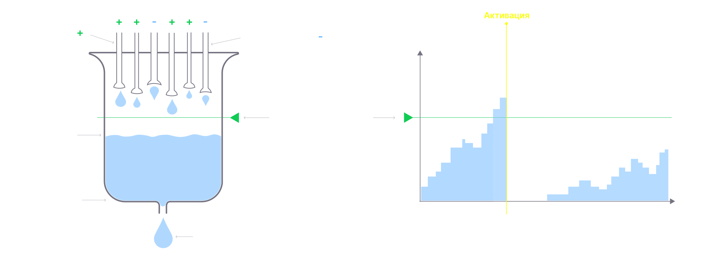
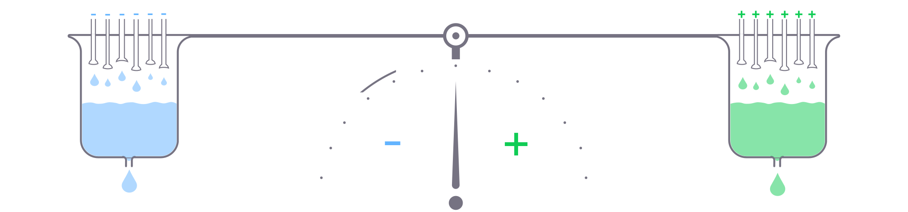
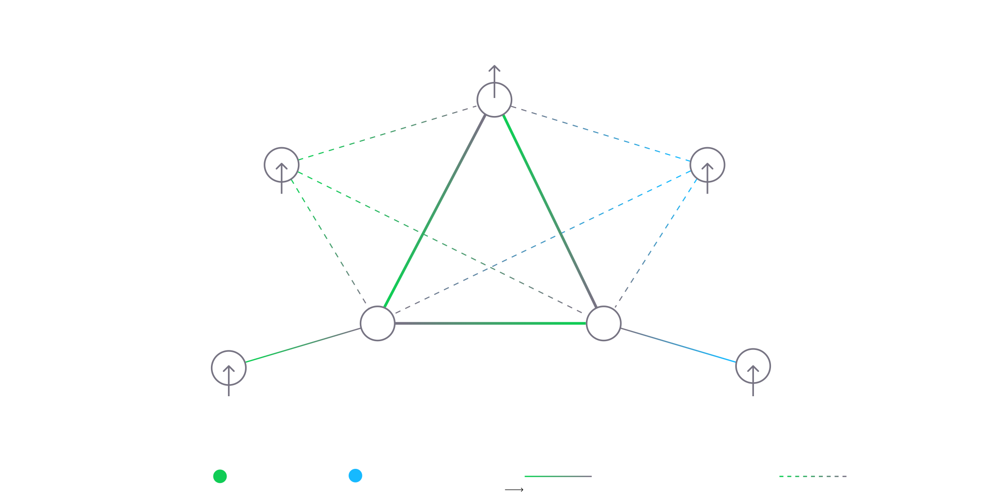

# Обзор нейронной модели

Движок FLUX следует пользовательской реализации модели модулированной импульсной нейронной сети, целью которой является поддержание идеального баланса между биологической точностью и вычислительной производительностью. Эта модель сводит биологическую нервную систему к ее основным функциональным характеристикам, избегая ненужной сложности. Модель вычислительно эффективна, но выразительна и биологически точна. Его простота и линейность позволяют легко реализовать это на аппаратном уровне. Давайте углубимся в его основные компоненты:

## Модулированный с утечкой нейрон с интеграцией и активацией

Нейрон в модели работает как простой сумматор. Он игнорирует сложные электродинамические свойства в пользу своей функциональной сущности и вычислительной эффективности. Нейрон в модели можно представить как негерметичный сосуд с жидкостью:

Каждый входящий синапс добавляет или вычитает некоторое количество жидкости из сосуда. В то время как жидкость также вытекает из сосуда с постоянной скоростью, которая контролируется свойством «протекания». Как только уровень жидкости достигает определенного «порога», нейрон запускает спайк, что означает, что он распространяет сигнал по всем своим активным синапсам, поэтому они влияют на «уровни жидкости» других нейронов. После спайка уровень падает до базового уровня, и нейрон вступает в «рефрактерный период», в течение которого нейрон игнорирует все поступающие сигналы.
Если уровень нейрона значительно превышает пороговое значение, он может взорваться серией спайков.

Если в течение рефрактерного периода поступает слишком много сигналов, это увеличивает его порог. Этот процесс называется привыканием и определяется «скоростью привыкания».

И наоборот, если нейрон длительное время не получает стимуляцию, он снижает свой порог. Этот процесс называется потенциированием и определяется «скоростью потенцирования».

Помимо механизма уровня, который опосредуется «прямыми синапсами», нейроны имеют механизм модуляции, который контролируется «модулирующими синапсами». Уровень модуляции не участвует в прямом срабатывании, но изменяет свойства нейрона, такие как порог и скорость обучения.
У модуляции тоже есть свой уровень, но он действует немного по-другому: уровень модуляции возвращается к балансу с определенной скоростью, а синапсы модуляции смещают баланс либо в отрицательную, либо в положительную сторону:

В случаях, когда сумма модуляции отрицательна, она ослабляет соответствующие свойства. Например, если порог модулируется, он будет временно увеличиваться, если уровень модуляции будет смещен в отрицательную сторону, поэтому нейрон становится менее чувствительным. В противном случае, если сумма модуляций положительна, она снижает свой порог, и нейроны становятся более чувствительными. Если уровень модуляции сбалансирован, это не имеет никакого эффекта.

## 3 типа синапсов

Модель имеет три типа синапсов, вдохновленных ее биологическими аналогами:
* «Прямой». Этот тип синапса либо тормозит нейрон-мишень, либо возбуждает его. В сосуде с жидкостной аналогией уровень жидкости либо повышают, либо уменьшают на ее вес. Его биологическую аналогию можно рассматривать как синапсы глутамата или ГАМК.
* `Модулятор`. Не влияет на срабатывание нейрона напрямую, но изменяет его свойства, такие как порог, скорость адаптации и т. д. Это вызвано различными нейромодуляторами в мозге, такими как дофамин, серотонин и норадреналин, но сводится к одному типу синапсов.
* `Электрик`. Заставляет целевой нейрон срабатывать безоговорочно, минуя процесс суммирования. В биологии это представлено соматическими синапсами, передающими разряд прямо на мембрану другого нейрона.

Synapse имеет вес, который можно рассматривать как «диаметр трубы». Если синапс «пластичен», вес может изменяться временно или постоянно с помощью механизмов кратковременной и долговременной памяти.

Вот простая реализация базового настраиваемого [Центрального генератора шаблонов] (https://en.wikipedia.org/wiki/Central_pattern_generator):

В этой минималистской сети генератор выдает ритмичный сигнал на определенной частоте. Модулируя нейроны генератора, мы можем манипулировать выходной частотой генератора. В реальном мире это может быть сеть, которая поддерживает уровень или возбуждение робота.

## Кратковременная и долговременная память

Реализации кратковременной и долговременной памяти основаны на процессах Хебба, зависящих от времени всплесков. Он поддерживает «хвост» нейронной активности, который в основном представляет собой реестр недавно активных нейронов с отметкой времени, и в случае, если нейрон срабатывает непосредственно перед другим нейроном, модель увеличивает синаптический вес соединительного синапса. В случае, если нейрон срабатывает непосредственно перед другим нейроном, он уменьшает синаптическую массу. Это реализация известного постулата Хебба:
> Нейроны, которые возбуждаются вместе, соединяются вместе. Нейроны, которые возбуждаются обособленно, разъединяются.

В зависимости от типа нейрона пластичность может иметь место только тогда, когда два нейрона соединены синапсом или если y связаны топологически.

Пластичность также является целью модуляции. Модуляция является основным инструментом сохранения изменения веса, «перевода» памяти из кратковременной в долговременную.

## Асинхронное выполнение

В сети нет центральных часов. Каждый нейрон управляет своим временем. Единственное, что синхронизирует сеть, — это возбуждение нейронов. Несоответствия в цикле событий добавляют естественный шум в динамику сети.