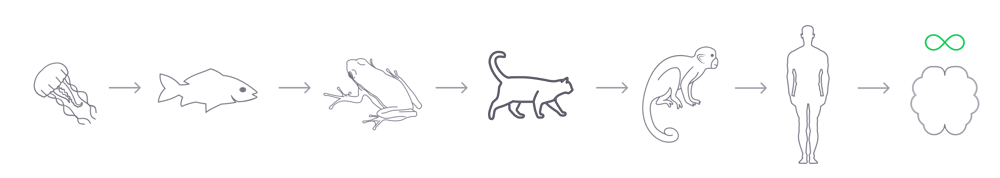

# Дорожная карта

Конечной целью FLUX является создание превосходного интеллекта.
## Наш путь к ОИИ

Современная наука, нейрофизиология и когнитивная психология накопили обширные знания о человеческом интеллекте, природе самого интеллекта на различных уровнях от клеточной химии до социального взаимодействия и культуры. Этого багажа нам достаточно, чтобы приблизиться к созданию сильного искусственного интеллекта. Нужно действовать последовательно, превращая знания в работающие модели, проходя эволюционный путь от простейших рефлекторных актов к самовосприятию, воображению, самосознанию.

### 1. Периферическая нервная система
Нейрофизиология очень подробно описывает нервную клетку - нейрон, и многие процессы, происходящие в ней, вплоть до отдельных белковых молекул, подробно описана механика синаптической передачи. Но мы не используем эти знания для управления, например, роботами и другими механизмами, хотя природа создала удивительный способ «программировать» поведение организмов с помощью простой нервной системы. И работает просто отлично. Это программирование имеет свои правила и закономерности, оно универсально и естественно.
Этот пункт включает в себя не только построение рефлекторных цепей, но на этом этапе появляются основные представления об эмоциях, потребностях и инстинктах. Рефлекторный контур может включать защитные рефлексы и реакции, состояние голода и насыщения, стремление к экономии энергии и взаимодействие всех этих механизмов. Это основа целенаправленного поведения и обучения при создании когнитивно высокоразвитых моделей.

### 2. Мозжечок.

Мозжечок является одним из древнейших отделов головного мозга. Основная деятельность головного мозга и нервной системы в целом представляет собой совокупность двигательных действий. Мозжечок делает двигательные акты более точными и согласованными, хранит память о коротких промежутках времени, является хронометром и секундомером всех двигательных действий. У него удивительная структура, нейробиологи называют его кристаллом. Строгие ряды клеток Пуркинье и пучки параллельных волокон, перпендикулярных их плоскости, обладают удивительным порядком в тканевой организации, не сравнимым с тканями других органов. Работа со временем требует точности и строгости.
Давайте представим, что мы создали базовые рефлексы для собаки-робота. Он может стоять, сидеть, ходить и бегать, но все это прекрасно работает в идеальных условиях, на ровных поверхностях без внешних воздействий, ударов, ветра и каких-либо дефектов в эксплуатации. Вот тут и приходит на помощь виртуальный мозжечок. Он легко интегрируется в нашу модель, так как работает как надстройка к двигательным сигналам ЦНС или безусловным рефлексам, корректирует сигналы в зависимости от сложившихся внешних условий, внутренних состояний и своей памяти.
Головной мозг человека содержит 86 миллиардов нейронов и 60 миллиардов из них относятся к мозжечку, преимущественно большинство нейронов мозжечка представляют собой очень мелкие, зернистые клетки, сгруппированные в ядрах мозжечка. Эти клетки получают множественные сигналы от базальных ганглиев — это дублирующие сигналы, управляющие мышцами, а зернистые клетки также получают сигналы от проприоцепции и вестибулярного аппарата. Объединяя все эти сигналы, зернистые клетки мозжечка, подобно клеткам Кеньона из грибовидного тела, образуют разреженное «маленькое» репрезентативное представительство. Взаимное тормозящее действие оставляет активным лишь небольшое количество нейронов, эта популяция активных клеток будет представлять собой ключ. Дело в том, что возможных вариаций и комбинаций внешних и внутренних сигналов бесчисленное множество, чтобы не возникала проблема комбинаторного взрыва, необходимо все это представлять в виде небольшого представления, трудно применить термин «маленький» к представлению почти 60 миллиардов клеток. Этот размер нам нужен как раз для точности, чтобы подобрать правильную настройку сигналов, управляющих мышцами.
Представьте себе технологию, в которой мы формируем базовые рефлексы у робота в реакторе, затем выпускаем его в виртуальную или реальную среду, наполненную испытаниями, он ошибается и падает, мы помогаем ему встать, и он пытается снова и снова, и в одновременно обучаться, корректировать те управляющие сигналы, которые ему задавали изначально.
Сейчас идет активное развитие антропоморфных роботов, и одной из самых сложных задач, которые решают инженеры, является координация моторики и управление балансом, почему бы не воспользоваться решениями, подсказанными природой.

### 3. Гиппокамп и когнитивные карты

Гиппокамп — древнее образование; эта область получила особое развитие у первых млекопитающих. Эти животные стали селиться в норах, а значит, им нужно было хорошо ориентироваться на местности, им нужно было находить пищу вдали от места своего обитания, а потом находить к нему дорогу обратно, им нужно было знать, где источник пищи, где вода источник есть, а где это просто опасно. Умение оперировать этими знаниями является одним из первых и фундаментальных познавательных функции живых организмов. Нобелевская премия за исследование клеток места, ячеек сетки, пограничных клеток, клеток направления и других особенностей нейронов гиппокампа была присуждена еще в 2014 году. Это важные знания, которые мы можем использовать на практике.
Понятие «место» для нервной системы, для когнитивной карты представляет собой совокупность различных признаков от различных органов чувств. «Место» может чем-то пахнуть, оно может быть влажным или сухим, может быть теплым или холодным, оно может быть полно яркой зелени, а может всегда быть темным. Поэтому гиппокамп получает сигналы от всех органов чувств, объединяет их и создает разреженное маленькое представление. Вам ничего не напоминает? Если схема работает, то природа будет использовать ее во многих местах и ​​формах. Но в случае с гиппокампом мы наложим на это репрезентативное представление слой ячеек сетки, этот слой добавит нашим данным некоторую планарность. Затем слой клеток направления, слой клеток границы, и в результате мы получаем активность клеток места - это будет когнитивная карта. Это на самом деле не все, мы дополним нашу когнитивную карту механизмом долговременного потенцирования запоминания последовательностей. Важно не только иметь координаты места, но и отмеченный путь к этому значимому месту. Природа всего этого изучена очень подробно.
Представьте робота-собаку в реальной или виртуальной среде, она легко передвигается по пересеченной местности благодаря модели мозжечка, эта среда довольно сложная и сложная, в нервной системе робота будет работать модель когнитивной карты, мы определим важность определенных места для робота сами, когда он найдет и запомнит путь к ним, мы сможем отправлять робота на задания и это без GPS (его может не быть в больших зданиях), без создания моделей или сканирования местности, робот найдет путь по памяти.
Значение этого этапа не только в ориентировании на местности, но и в том, что когнитивная карта первых млекопитающих перерастает в эксплицитную память. На основании чего первые млекопитающие строят, запоминают и воспроизводят маршрут к водопою, Человек использует, например, чтобы рассказать историю своей жизни со всеми ее поворотами и знаковыми местами и событиями.
Он также используется в качестве шаблона для построения сложных карт знаний, и большинство мыслительных процессов можно свести к навигации в этом пространстве знаний.

### 4. Кора головного мозга

С точки зрения эволюционного развития появление коры головного мозга было большим прорывом. Кора позволяла более эффективно обрабатывать, хранить и структурировать информацию из внешней среды. Все мы знаем о прорывных успехах современных нейронных сетей, но эти модели не идут ни в какое сравнение со способностью человеческого мозга обобщать и выделять ключевые закономерности во входных данных, что позволяет ему учиться на очень небольшом количестве примеров. В современных компьютерных моделях сетей есть понятие простого нейрона, или сумматора. Еще в начале 1960-х годов Торстен Визель и Дэвид Хьюбел обнаружили в зрительной коре кошки так называемые сложные клетки. Мы можем использовать концепцию сложных нейронов, создавать из них сети и обучать эти сети по совершенно другим принципам и правилам, отличным от общепринятых сейчас в машинном обучении. Работа над этим активно ведется, хотя на данный момент описанные сети уступают по некоторым показателям сетям на основе классического подхода, но уже прослеживаются некоторые существенные преимущества описанного подхода.
Сложные нейроны реагируют на сложные раздражители, в частности, вы можете представить себе нейрон (или группу нейронов) в своем мозгу, который будет активно реагировать на образ вашей бабушки, или просто вспоминая ее, мы можем найти соответствующий нейрон практически для каждого предмет, предмет, символ или понятие. Представьте, насколько удобно использовать нейронную сеть, состоящую из однотипных нейронов, во-первых, мы можем оценить, о чем сеть «думает» в данный момент по активности нейронов, мы можем понять, как она принимает решения, мы можем управлять этими решениями просто путем активации необходимых нейронов.

### 5. Зоны Брока и Вернике. Коммуникация.

Речь – это прежде всего двигательное действие. Мы учимся говорить так же, как учимся управлять своим телом. Все начинается с воркования, повторения одних и тех же звуков, затем отдельных слов, затем словосочетаний, затем предложений. Хорошо развитый мозжечок значительно ускоряет этот процесс, он получает управляющие сигналы от двигательной зоны коры Брока. Часть коры, называемая зоной Вернике, воспринимает и анализирует звуковые сигналы, связанные с речью. Симбиоз работы этих систем дает нам возможность говорить и учиться речи.
Речь является основным инструментом взаимодействия людей друг с другом, а в перспективе с роботами и искусственным интеллектом. Мы подойдем к этому этапу нашей маршрутной карты, подготовленной во многих отношениях. тс. Все, что нам нужно для прохождения этого этапа, мы получим из предыдущих пунктов. ОИИ буквально проходит этапы развития речи, как и Человек, начиная с воркования, повторения и заканчивая произнесением осмысленных фраз.

### 6. Префронтальная кора. Рассуждения и планирование.

Считается, что префронтальная кора представляет собой высокоразвитую обонятельную луковицу. Это очень обширная область коры, нейробиологи называют ее «великим супрессором». Дело в том, что префронтальная кора контролирует глубокие, древние области мозга, отвечающие за эмоции, инстинкты и потребности. Контроль животных инстинктов, воля и самообладание, долгосрочное планирование – вот что отличает Человека от других животных. Придать эти качества нашим сотрудникам в AGI вполне реальная задача. Еще в начале нашего пути мы заложили основу для понимания принципов работы эмоций, механизмов потребностей и инстинктов, а с получением искусственной модели коры можно будет управлять поведением не только «снизу вверх» (инстинкт управляет поведением), но и «сверху вниз» (сознание, воображение и планирование определяют поведение).

Описанный здесь путь оказался эволюционно правильным, что делает его достаточно устойчивым и методичным. Каждый балл даст нам технологию для создания очень полезных и востребованных продуктов, а также расширит наши знания о нервной системе и о нас самих.

## «Моральные ценности» ОГИ
Нам нужно очень осторожно относиться к системам ценностей ИИ и не позволять ему использовать свой творческий потенциал для нанесения прямого или косвенного, преднамеренного или непреднамеренного вреда. Каждое решение, которое принимает ИИ, по сути является переходом из одного состояния в другое. Каждый переход должен:

Индивидуально-групповая шкала:
* Улучшает состояние человека
* Улучшает состояние группы.
* Улучшает состояние органической жизни.

Шкала уверенности-неопределенности:
Есть еще фактор времени. Таким образом, решение должно соответствовать всем векторам и работать для большинства временных масштабов, предпочтительно для текущего, но без отступления в прошлое.
Существует также определенность и фактор риска, означающий, может ли это быть рискованным или нет.

Минимально-радикальная шкала:
Эта оценка происходит как часть мыслительного процесса, пока в конце концов не будет найдено решение.

## Будущие цели технологии FLUX
* Использование WebGPU и WebAssembly для повышения производительности движка.
* Протокол RTC для эффективной связи между устройствами
* платформа нейронных облачных вычислений, объединяющая всех клиентов в единую взаимосвязанную нейронную сеть.
* Нейроморфная аппаратная реализация